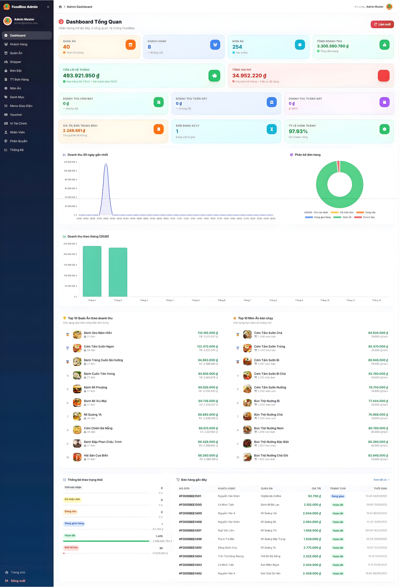
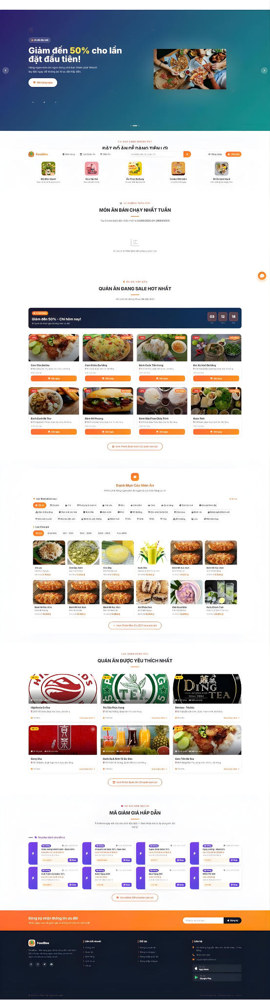

# 🍔 FoodBee — Giao đồ ăn tận nơi, trải nghiệm tuyệt vời

<div align="center">
  
  
  <br/>
  
  <a href="https://foodbee.io.vn/">
    
  </a>
  <a href="https://be.foodbee.io.vn/api/documentation">
    
  </a>
  <a href="https://be.foodbee.io.vn/">
    
  </a>
  
  <br/>
  
  <a href="LICENSE">
    
  </a>
  
  <br/>
  
  <a href="CONTRIBUTING.md">🤝 Đóng Góp</a> •
  <a href="CHANGELOG.md">📜 Changelog</a>

</div>

 
<!-- Thay ảnh Banner của bạn vào đây -->

> _"Mang đến bữa ăn ngon - Nhanh chóng - Tiện lợi"_

## 📖 Tổng Quan

**FoodBee** là một dự án ứng dụng đặt và giao đồ ăn trực tuyến hiện đại. Dự án được thiết kế trong lĩnh vực **F&B và thương mại điện tử**, với các mục tiêu:

🔗 **Kết nối Khách hàng - Quán ăn - Shipper** một cách hiệu quả  
📊 **Quản lý đơn hàng và thanh toán** một cách chuyên nghiệp  
💡 **Mang lại sự tiện lợi, nhanh chóng** cho trải nghiệm ăn uống  
📝 **Minh bạch thông tin** trong quá trình giao nhận và hiển thị đánh giá

Dự án tập trung vào việc xây dựng nền tảng Web App mượt mà, kết hợp xử lý dữ liệu thời gian thực (Real-time WebSocket), hệ thống bản đồ số và dịch vụ thanh toán tự động hóa để tạo ra một hệ sinh thái F&B năng động.

---

## 📸 Giao diện

### 🖥️ Giao diện Quán ăn & Trạng thái Đơn hàng

<p align="center">
  
</p>
<p align="center"><em>Trang quản lý đơn hàng Quán ăn - Hiển thị đơn chờ xác nhận, đơn đang chuẩn bị</em></p>

### 🖥️ Giao diện Khách hàng (Website / Desktop)

<p align="center">
  
</p>
<p align="center"><em>Khách hàng xem danh sách quán ăn và chọn món ăn trên giao diện PC rộng rãi</em></p>

### 📱 Giao diện Khách hàng & Shipper (Mobile Responsive)

<p align="center">
  
  
  
  
</p>
<p align="center"><em>Khách hàng đặt món, áp dụng Voucher và theo dõi đơn hàng Real-time</em></p>

> **Lưu ý:** Vui lòng cập nhật hình ảnh chụp màn hình thực tế của bạn vào thư mục dự án và đổi `src` ở phần này.

---

## 👥 Đối tượng hướng đến

1. **Khách hàng:** Dễ dàng tìm kiếm món ăn, đặt hàng, áp dụng mã giảm giá và thanh toán tiện lợi (COD / PayOS).
2. **Quán ăn (Partner):** Có công cụ quản lý trực quan để cập nhật thực đơn, tiếp nhận và xác nhận đơn hàng theo thời gian thực.
3. **Shipper:** Hệ thống định vị bản đồ hỗ trợ nhận đơn nhanh chóng, tối ưu hóa cung đường giao hàng đến tay người dùng.

---

## ✨ Modules chính của FoodBee

### 1. 📱 Module tương tác Khách hàng
- 🛒 Đặt đồ ăn, giỏ hàng, áp dụng voucher
- 💳 Thanh toán đa dạng (COD, chuyển khoản tự động qua PayOS)
- 📍 Theo dõi chi tiết tiến trình đơn hàng (Real-time Maptiler)
- 🔐 Đăng xuất/Đăng nhập (Hỗ trợ đăng nhập Google)

### 2. 🏪 Module Quản lý Quán ăn
- 🍲 Quản lý thực đơn, món ăn, danh mục
- 📋 Cập nhật và xác nhận đơn hàng thời gian thực
- 📉 Thống kê doanh thu, báo cáo hoạt động
- ⚙️ Quản lý và cấu hình thông tin cửa hàng

### 3. 🛵 Module Shipper
- 📦 Cửa số tiếp nhận và săn đơn hàng xung quanh
- 🗺️ Tích hợp bản đồ Maptiler định vị tọa độ
- ✅ Phát thông báo cập nhật trạng thái đơn (Đã lấy, Đang giao...)

### 4. 📊 Module Admin Hệ thống
- 📉 Dashboard tổng quan doanh thu toàn sàn
- 📂 Duyệt quán ăn, duyệt shipper
- ⚙️ Phân quyền, phát hành Voucher (Flash Sale)
- 📊 Quản trị banner, danh mục chính của hệ thống

---

## 🗺️ Kiến Trúc Hệ Thống

Hệ thống được thiết kế rõ ràng và tách biệt, đảm bảo tính dễ nâng cấp và xử lý thời gian thực nhanh nhạy:

| Thành phần             | Công nghệ sử dụng                                                  |
| :--------------------- | :----------------------------------------------------------------- |
| **Frontend Root**      | `React 19`, `Vite`, `React Router v7`                              |
| **Giao diện (UI)**     | `Tailwind CSS`, `PostCSS`, `FontAwesome`                           |
| **Core API (Backend)** | `Laravel 11` (PHP), `Laravel Sanctum` (Auth)                       |
| **Realtime WebSockets**| `Laravel Echo`, `Pusher JS`, `Laravel Reverb`                      |
| **Bản đồ & Tọa độ**    | `MapTiler API`                                                     |
| **Cổng thanh toán**    | `PayOS` (Chuyển khoản QR code tự động)                             |
| **Xác thực Social**    | `@react-oauth/google`                                              |
| **Databases**          | `MySQL`                                                            |
| **Thống kê**           | `Chart.js`, `react-chartjs-2`                                      |

---

## 🪛 Service của FoodBee

Xem tài liệu API Backend phục vụ hệ thống tại [API Docs](https://be.foodbee.io.vn/).

Truy cập hệ thống dành cho người dùng tại: [trang chủ FoodBee](https://foodbee.io.vn/).

```
Tài khoản Khách hàng demo:
username: khachhang@gmail.com
password: 123456
```

```
Tài khoản Quán ăn demo:
username: quanan@gmail.com
password: 123456
```

---

## 🔗 Thanh Toán Tự Động & Real-time WebSockets

**Yêu cầu kỹ thuật:** FoodBee được tích hợp cổng thanh toán trực tuyến và hệ thống cập nhật trạng thái thời gian thực.

### 📡 Real-time với Laravel Reverb
Ứng dụng tương tác hai chiều không cần tải lại trang thông qua WebSockets. Khi Khách hàng đặt món, chuông và thông báo lập tức nổ ở máy của Quán ăn và Shipper dựa trên **Event Broadcasting**.
- Sử dụng **Laravel Echo** phía frontend.
- Cấu hình Private Channels để bảo vệ quyền riêng tư đơn hàng.

###💳 Thanh toán với PayOS
- Tạo mã QR động cho từng đơn hàng cụ thể.
- Hệ thống webhook từ PayOS gọi về Backend Server để tự động cập nhật trạng thái **"Đã thanh toán"**.

---

## 🌱 Hướng phát triển

Dự án không chỉ dừng lại ở giao nhận thực phẩm mà còn hướng tới hệ sinh thái dịch vụ cao cấp hơn:
- **Tối ưu định tuyến:** Sử dụng thuật toán AI để gợi ý cung đường lấy/giao hàng cùng lúc cho Shipper để tối đa lợi nhuận.
- **Tính năng Chat Real-time:** Box chat trực tiếp giữa Khách Hàng - Quán Ăn - Shipper.
- **Hệ thống đánh giá/Gợi ý thông minh (Recommend):** Gợi ý đồ ăn dựa theo lịch sử phân tích dữ liệu mua sắm của người dùng.

---

## 🗂️ Cấu trúc dự án

```text
SHOPEFOOD_FE/
├── public/                 # Tài nguyên static, hình ảnh
├── src/                    # Source Code React
│   ├── assets/             # Hình ảnh (logo, backgrounds...)
│   ├── components/         # Components tái sử dụng (Header, Footer, Toast...)
│   ├── context/            # AuthContext, Global states
│   ├── pages/              # Giao diện chính của hệ thống
│   │   ├── KhachHang/      # Giao diện riêng cho Customer
│   │   ├── QuanAn/         # Giao diện riêng cho Nhà Cung Cấp
│   │   └── Shipper/        # Giao diện riêng cho Tài xế
│   ├── utils/              # Code tích hợp API, Axios configs
│   ├── App.jsx             # React Routers Navigation
│   ├── main.jsx            # Entry point
│   └── index.css           # Tailwind Entry
├── .env                    # Biến cấu hình môi trường Vite
├── package.json            # Thư viện & Scripts
├── tailwind.config.js      # Cấu hình Tailwind styling
└── vite.config.js          # Build tool settings
```

## 🛠️ Hướng dẫn cài đặt

### 🚀 Cài đặt nhanh với NPM / Yarn

**Yêu cầu**: Node.js >= 18.x

**Cách 1 - Windows / macOS / Linux:**

```bash
# 1. Clone repository
git clone https://github.com/IzooBeeee/FE_VER2_SHOPEFOOD_FAKE.git

# 2. Cài đặt packages
npm install

# 3. Tạo file cấu hình môi trường
cp .env.example .env
# Chỉnh sửa biến trong .env khớp với Backend/PayOS/Reverb của bạn

# 4. Chạy chế độ phát triển (Development)
npm run dev
```

> 📖 Truy cập hệ thống local qua trình duyệt: `https://foodbee.io.vn/`.

### Tiến hành Build (Production)
```bash
npm run build
```
Dự án sẽ xuất ra thư mục `dist/` để bạn deploy lên Nginx, Vercel hoặc Hostinger.

---

## 🤝 Đóng Góp Cho Dự Án

### 🌱 Quy Trình Đóng Góp

**1. Fork Repository**
```bash
git clone https://github.com/IzooBeeee/FE_VER2_SHOPEFOOD_FAKE.git
```

**2. Tạo Branch Mới**
```bash
git checkout -b feat/checkout-module
```

**3. Commit Thay Đổi**
```bash
git add .
git commit -m "feat: add missing payment logic"
```

**4. Push & Tạo Pull Request**
- Khởi tạo Pull Request trên nhánh github trỏ về nhánh `main` / `master` của dự án gốc.

---

## ⚖️ Quy Tắc Ứng Xử

Dự án này tuân theo bộ quy tắc ứng xử cho cộng đồng. Vui lòng đảm bảo các pull request và trao đổi mang tính xây dựng.

## 💬 Cộng đồng & Hỗ trợ

### Liên hệ Team Development

Nếu cần trao đổi gì thêm hoặc muốn báo lỗi hệ thống, vui lòng liên hệ:

- **Nguyễn Văn Nhân**: vannhan130504@gmail.com


---

## 📜 Changelog
Xem thay đổi mới nhất trực tiếp dựa list Commit của nhánh main.

## 📄 Giấy Phép
Dự án được phân phối phi thương mại cho mục đích học tập và bảo vệ đồ án/cuộc thi.

---

© 2025 FoodBee – Code with ❤️ by DTU Team
