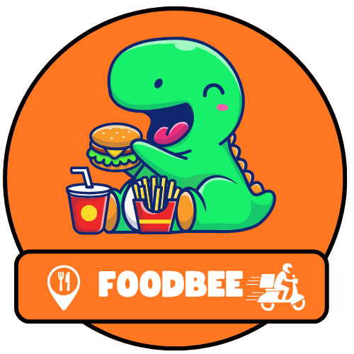
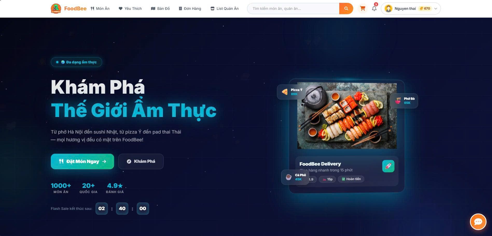
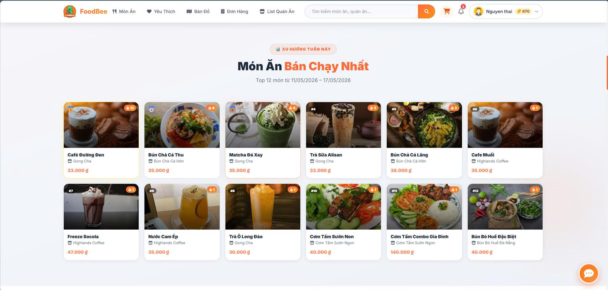
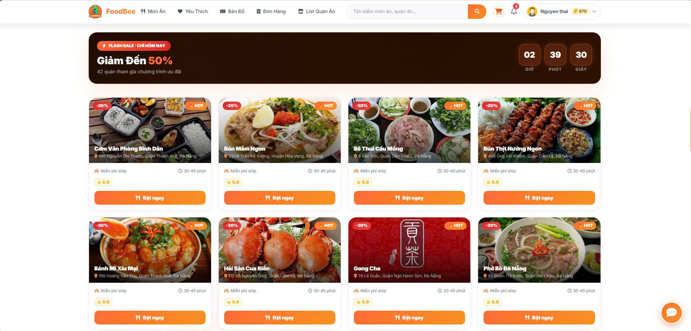
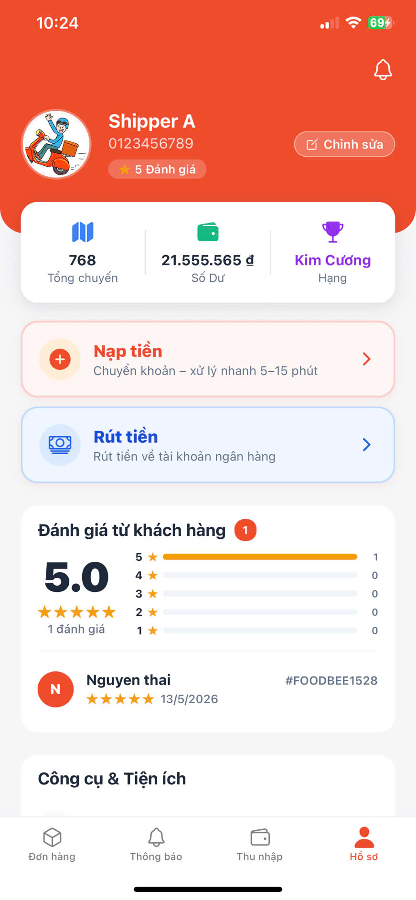
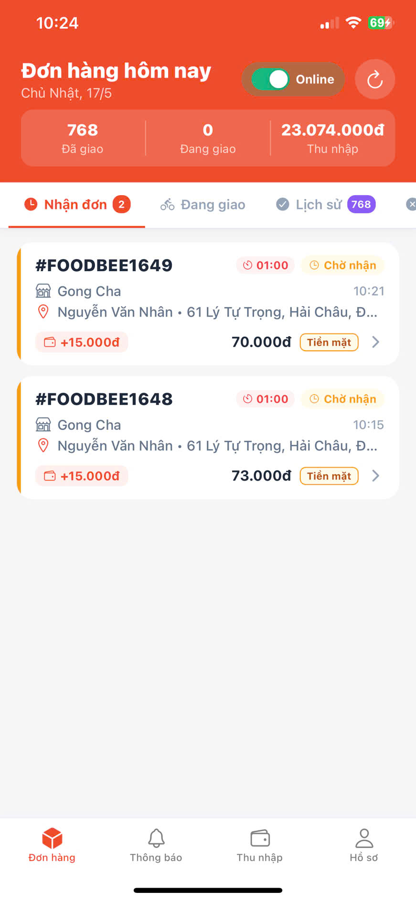
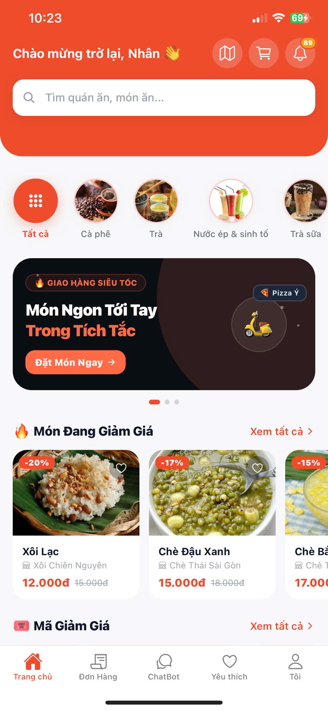
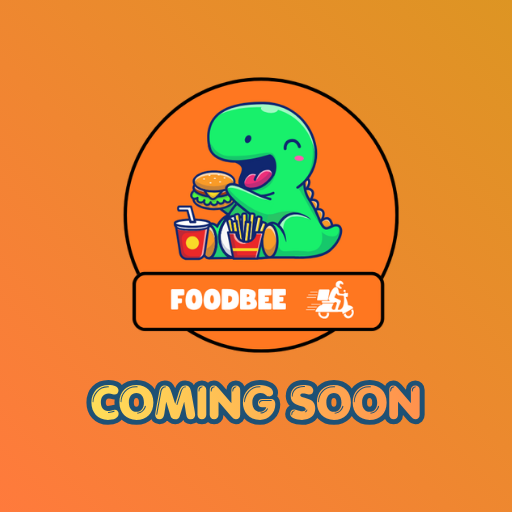

# 🍔 FOODBEE - HỆ THỐNG ĐẶT VÀ GIAO ĐỒ ĂN ĐA NỀN TẢNG TÍCH HỢP GỢI Ý MÓN ĂN BẰNG AI

<div align="center">
  
  
  <br/>
  
  <a href="https://foodbee.io.vn/">
    
  </a>
  <a href="https://KLTN-03-2026.github.io/GR56/">
    
  </a>
  <a href="https://be.foodbee.io.vn/api/documentation">
    
  </a>
  
  <br/>
  
  <a href="CONTRIBUTING.md">🤝 Đóng Góp</a> •
  <a href="CODE_OF_CONDUCT.md">⚖️ Quy tắc ứng xử</a> •
  <a href="https://github.com/KLTN-03-2026/GR56/commits/master">📜 Lịch sử thay đổi</a>
</div>

<div align="center">
  <p><i>"Giải pháp công nghệ kết nối Khách hàng - Quán ăn - Shipper trên đa nền tảng"</i></p>
</div>

---

### 📌 Thông tin dự án (Project Information)

| **Danh mục** | **Chi tiết** |
| :--- | :--- |
| 🌐 **Website** | [foodbee.io.vn](https://foodbee.io.vn/) |
| 📄 **Tài liệu** | [Full Documentation](docs/intro.md) |
| ⚖️ **Giấy phép** | [GNU GPL v3.0](LICENSE) |
| 🤝 **Đóng góp** | [Contributing Guide](CONTRIBUTING.md) |
| ⚖️ **Quy tắc** | [Code of Conduct](CODE_OF_CONDUCT.md) |
| 🚀 **Phiên bản** | `v1.0.0-stable` |
| 🛠️ **Trạng thái** |  |

---

---

## 📖 Tổng Quan Dự Án

**FoodBee** không chỉ là một ứng dụng đặt món, mà là một **Hệ sinh thái F&B** hoàn chỉnh được xây dựng trên kiến trúc Micro-services và giao tiếp thời gian thực. Dự án bao gồm các nền tảng:

*   💻 **Web App (Frontend):** Dành cho khách hàng trải nghiệm trên PC/Laptop.
*   📱 **Mobile App (Android/iOS):** Ứng dụng di động mượt mà cho Khách hàng và Shipper.
*   ⚙️ **Core API (Backend):** Hệ thống quản trị dữ liệu, thanh toán và xử lý đơn hàng.
*   🤖 **AI Chatbot:** Hỗ trợ gợi ý món ăn và giải đáp thắc mắc thông minh.

---

## 📸 Giao diện Hệ thống

### 🖥️ Dashboard Quản Trị Quán Ăn
*Hệ thống quản lý đơn hàng, doanh thu và thực đơn trực quan dành cho Đối tác.*
<p align="center">
  
</p>

<br/>

### 🌐 Giao diện Khách hàng (Website)
*Trải nghiệm đặt món mượt mà với đầy đủ tính năng tìm kiếm, lọc và thanh toán.*

<p align="center">
  
  
</p>

<p align="center">
  
</p>

<br/>

### 📱 Giao diện Ứng dụng Di động (Mobile App)
*Ứng dụng di động dành cho Khách hàng và Shipper với giao diện tối ưu, thao tác nhanh chóng.*
<p align="center">
  
  
  
</p>

---

## 🗂️ Cấu Trúc Toàn Bộ Dự Án (Workspace)

Dự án được tổ chức theo cấu trúc đa thư mục (Monorepo), quản lý các Module độc lập:

```text
GR56/
├── 📱 apps/
│   ├── mobile-android/     # Source code chính của ứng dụng di động Android
│   ├── mobile-ios/         # Source code chính của ứng dụng di động iOS
│   ├── web-frontend/       # Web App cho Khách hàng, Quán ăn, Shipper (ReactJS)
│   └── docs-site/          # Trang chủ Documentation (Docusaurus)
├── ⚙️ services/
│   ├── api-backend/        # Core Backend API (Laravel 11)
│   └── chatbot-ai/         # Hệ thống AI Chatbot (Python)
├── 📜 docs/                # Quy chuẩn Commit và tài liệu hướng dẫn chung
└── 🛠️ scripts/             # Chứa các script tiện ích
    └── git-rules/          # Menu hỗ trợ git workflow tự động
```

---

## 🛠️ Công Nghệ Sử Dụng

### 🛰️ Core & Real-time (Backend)
- **Framework:** `Laravel 11`, `PHP 8.2+`
- **Real-time:** `Laravel Reverb` (WebSockets)
- **Auth:** `Laravel Sanctum` & `Socialite` (Google Login)
- **Thanh toán:** `PayOS SDK` (Tự động hóa QR chuyển khoản)
- **Database:** `MySQL`

### 🎨 Giao diện (Frontend & Mobile)
- **Web:** `React 19`, `Vite`, `Tailwind CSS`, `React Router v7`
- **Mobile:** `React Native`, `Expo`, `React Navigation`
- **Bản đồ:** `MapTiler API` & `Leaflet`
- **Chart:** `Chart.js` (Thống kê doanh thu)

### 🧠 AI & Automation
- **AI Tool:** `Python`, `Flask` (Chatbot API)
- **Workflow:** `GitHub Actions` (Auto-bot contributor)

---

## 🚀 Hướng Dẫn Cài Đặt

Dự án yêu cầu cài đặt riêng biệt cho từng Module:

### 1. Khởi tạo Backend (BE)
```bash
cd services/api-backend
composer install
cp .env.example .env # Cấu hình DB_DATABASE, PAYOS_..., REVERB_...
php artisan key:generate
php artisan migrate --seed
php artisan serve
```

### 2. Khởi tạo Frontend (FE)
```bash
cd apps/web-frontend
npm install
cp .env.example .env # Cấu hình VITE_API_URL trỏ về BE
npm run dev
```

### 3. Khởi tạo Mobile App (APP/IOS)
```bash
cd apps/mobile-android # Hoặc cd apps/mobile-ios
npm install
npx react-native run-android # Hoặc npx react-native run-ios
```

---

## 🛠️ Công cụ hỗ trợ Developer

Chúng tôi cung cấp script **`git-menu.sh`** để tự động hóa quy trình làm việc với Git:
- **Tự động Prefix:** feat, fix, chore, docs...
- **Push nhanh:** Tự động nhận diện nhánh và đẩy code.

Cách sử dụng:
```bash
./scripts/git-rules/git-menu.sh
```

---

## 🤝 Đội ngũ Phát triển

Mọi thắc mắc và hỗ trợ kỹ thuật, vui lòng liên hệ:
- **Nguyễn Văn Nhân**: [vannhan130504@gmail.com](mailto:vannhan130504@gmail.com)

---

## 📲 Tải Ứng Dụng

<p align="center">
  <div style="display: flex; justify-content: center; gap: 20px; flex-wrap: wrap;">
    <div style="text-align: center;">
      
      <br/>
      <a href="https://play.google.com/store/apps/details?id=com.shoppefood">
        
      </a>
    </div>
    <div style="text-align: center;">
      
      <br/>
      <a href="">
        
      </a>
    </div>
  </div>
</p>
---
© 2026 FOODBEE – Nền tảng giao đồ ăn thế hệ mới.
